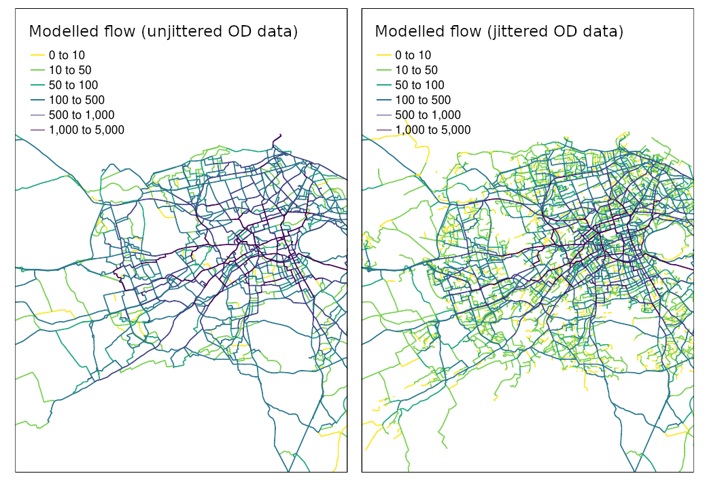

<!-- README.md is generated from README.Rmd. Please edit that file -->

```{r, include=FALSE}
knitr::opts_chunk$set(
  collapse = TRUE,
  comment = "#>",
  echo = FALSE,
  message = FALSE,
  cache = TRUE,
  warning = FALSE,
  fig.align = "center"
)
# devtools::install_github("itsleeds/od")
library(sf)
library(tmap)
library(tidyverse)
library(stplanr)
```

```{r, eval=FALSE}
file.copy("README.html", "jittering-paper.html")
file.copy("README.pdf", "jittering-paper-resubmission2.pdf", TRUE)
piggyback::pb_upload("jittering-paper-resubmission2.pdf")
piggyback::pb_download_url("jittering-paper-resubmission2.pdf")
# https://github.com/Robinlovelace/odjitter/releases/download/1/jittering-paper-resubmission2.pdf
# Generate citations (requires Zotero)
library(rbbt)
# old way:
# bbt_write_bib(path = "references.bib", keys = bbt_detect_citations("README.Rmd"), overwrite = TRUE)
# new way:
bbt_update_bib("README.Rmd", "references.bib")
# trackdown::upload_file(file = "README.Rmd", path_output = "README.docx")
# trackdown::update_file(file = "README.Rmd", path_output = "README.docx")
# create diff
system("latexdiff ../odjitter-original-submission/README.tex README.tex > diff.tex")
tinytex::pdflatex("diff.tex")
browseURL("diff.pdf")
piggyback::pb_upload("diff.pdf")
zip("jittering-paper-code.zip", files = c("odjitter-paper.R", "odjitter-paper.sh"))
piggyback::pb_upload("jittering-paper-code.zip")
```

<!-- badges: start -->
<!-- badges: end -->

# Abstract {-}

Origin-destination (OD) datasets are often represented as trips between zone centroids, resulting in concentration of flows to few unique points.
This paper presents a 'jittering' approach to tackling this problem by (1) sampling unique points for each OD pair, and (2) splitting 'large' OD pairs representing many trips into 'sub-OD' pairs.
We find that route networks generated from jittered OD data are more diffuse, based on an example dataset representing walking trips, with potential benefits for transport planners relying on model results.
Further work is needed to validate the approach and to find optimal parameters for sampling and disaggregation.

# Questions

Origin-destination (OD) datasets are widely used in transport planning to efficiently represent aggregate travel behavior.
Despite emerging 'big data' sources such as massive GPS datasets, OD data continues to play an established --- if not central --- role in 21^st^ century transport planning and modelling.
Recent applications range from analysis of the evolution of urban activity and shared mobility services over time [e.g. @shi_exploring_2019; @li_effects_2019] to inference of congestion and mode split [@bachir_inferring_2019; @gao_method_2021].

<!-- Perhaps in part because they are so well established, comparatively few recent research papers have explored new methods for processing OD datasets. -->
There has been much written on optimal zoning systems for representing and modelling OD data [e.g. @openshaw_optimal_1977].
Recent papers have presented new methods for OD dataset validation [@alexander_validation_2015], aggregation [@he_simple_2018; @liu_snn_2021], disaggregation [@katranji_mobility_2016] and location of 'connectors' joining zone centroids with the surrounding network [@jafari_investigation_2015].
Broadly, there are three approaches to converting OD data into geographic representations for transport modelling:

1. Centroid to centroid representations, a common approach involving the simplifying assumption that all trip destinations and origins can be represented by (sometimes population weighted or aggregated) zone centroids [@guo_origindestination_2014; @martin_origindestination_2018]
2. Subdividing zones at which data is available to subzones [@opie_commodityspecific_2009] or 'centroid connectors' or simply 'connectors' "between trip ends and zonal anchors" using randomised or deterministic approaches [@leurent_stochastic_2011]

In this paper we present a new approach to processing OD datasets which combines OD data disggregation *and* randomisation of start and end locations into a single technique.
The 'jittering' approach we present is flexible, enabling the user to adjust the level of disaggregation required for their applications and start and end points from which disaggregate OD pairs are sampled.
 <!-- appropriate start points and trip attractors, and weights highlighting the relative importance of different origin and destination points. -->

Unlike aforementioned papers, jittering can be understood as a simple, transparent and flexible pre-processing stage that can add value to OD datasets by representing the diffuse nature of travel networks.
This is particularly important when designing for active travel [@buehler_bikeway_2016], explaining the choice of input data to illustrate the technique in this paper: it was developed to support active travel planning in an applied setting funded by Edinburgh City Council.
We developed the approach to support strategic investment in walking and cycling infrastructure networks based on our observation that route networks resulting from OD pairs from and to single centroids per zone were too sparse.
The approach can 'slot into' existing transport modelling workflows that use desire lines which can be used as the basis of route network assignment, uptake modelling, and route network generation modelling workflows [@morgan_travel_2020].
<!-- todo: add flow diagram -->
We refer to the approach as jittering, noting the use term to describe a similar process of adding "random noise to the data" for data visualization [@wickham_ggplot2_2016].

<!-- In this paper we outline such methods and their uses, demonstrating how jittering can be used to create more diffuse and accurate estimates of movement at the level of segments ('flows') on transport network, with minimal computational overheads compared with the computationally intensive process of route calculation ('routing') or processing large GPS datasets. -->
<!-- Long version of paper: -->
<!-- We do this by defining OD datasets, their uses, and other terms in relation to jittering, in Section \@ref(od); describing a real world case study, input datasets, and methods, in Section \@ref(methods); presenting the results of different jittering techniques in Section \@ref(findings); and discussing the potential uses of and next steps for the development of methods to add value to OD datasets for sustainable transport planning in section \@ref(discussion). -->
<!-- Short version of paper: -->
<!-- We do this by defining OD datasets, their uses, and other terms in relation to jittering, in this introduction; outlining the research question with reference to a real world case study of modelling cycling networks in Edinburgh, in Section \@ref(q); describing the results in Section \@ref(methods); and presenting the results of different jittering techniques in Section \@ref(findings). -->

<!-- # Origin-destination data {#od} -->

<!-- First, a description of the utility of OD data in contemporary policy contexts, and definitions, are in order. -->

<!-- An example of the utility of OD data, and the utility of open access (anonymised and aggregtated) OD data in particular, is Propensity to Cycle Tool (PCT), first launched nationally across England in 2017 [@lovelace_propensity_2017]. -->
<!-- The PCT provides a strong and consistent evidence-base that local authorities across England and Wales are using to inform strategic Local Cycling and Walking Plans. -->
<!-- Based on OD data --- initially for commuting trips only but subsequently also based on travel to school data [@goodman_scenarios_2019] --- the tool visualises cycling potential at zone, desire line, route and route network levels, and is being used by government, consultancy and public/advocacy stakeholders nationwide [@lovelace_open_2020]. -->
<!-- The PCT makes open OD data 'come to life' by converting a 'haystack' of data into meaningful insights into currently cycling levels and future potential, highlighting the need to invest in cohesive networks of cycling interventions, as illustrated in Figure \@ref(fig:haystack). -->

```{r haystack, fig.cap="Illustration of how geographic visualisation and routing can add value to OD datasets and make them more policy relevant."}
# todo: update this if needed, commented out to save space and cut to the chase!
# knitr::include_graphics("https://user-images.githubusercontent.com/1825120/142071229-81358e26-5e8d-437e-9ef8-91704a4e690f.png")
```


<!-- The PCT is available for use by local authorities, consultancies, cycling advocacy groups, academic researchers and members of the public. -->
<!-- Subsequent work building on the tool has been used to prioritise investment in active transport in the wake of the coronavirus pandemic [@lovelace_methods_2020]. -->
<!-- Comparable tools have yet to be developed and deployed publicly in most other countries. -->
<!-- With the exception of regionally specific models using software such as sDNA [@cooper_using_2017] (the results of which are usually not in the public domain) and bespoke city-specific models [@larsen_build_2013; @zhang_prioritizing_2014], there are few large scale tools using OD data that are free for public use that we are aware of. -->

<!-- In this context, this paper outlines methods to add further value to OD data through processes of disaggregating OD data and 'jittering' to increase the density of route networks arising from the conversion of OD data into route network outputs of the kind illustrated in Figure \@ref(fig:haystack). -->

The jittering approach presented in this paper was motivated by the following question:

> How can OD data representing trips between large geographic zones be used more effectively, to generate diffuse route networks of current or potential flow to inform local interventions?

<!-- Our hypothesis is that jittering leads to more effective use of OD data in transport planning. -->
<!-- Before describing the approach to answer this question, some definitions are in order: -->

<!-- , it is worth briefly defining OD data: datasets that consist of: -->
<!-- - **Origins**: locations of trip departure, typically stored as ID codes linking to zones -->
<!-- - **Destinations**: trip destinations, also stored as ID codes linking to zones -->
<!-- - **Attributes**: the number of trips made between each 'OD pair' and additional attributes such as route distance between each OD pair -->
<!-- - **Jittering**: The combined process of 'splitting' OD pairs representing many trips into multiple 'sub OD' pairs (disaggregation) and assigning origins and destinations to multiple unique points within each zone -->

# Methods {#methods}

<!-- The methods described in this paper were developed to support a project to support Edinburgh City Council with their strategic cycle network planning activity. -->
<!-- To understand the method and results it makes sense to start by introducing the case study area. -->
<!-- ## A synthetic example: synthetic zones -->
<!-- ## Real world example: Edinburgh -->

The approach was developed to support public sector transport planning in Edinburgh.
As illustrated in Figure \@ref(fig:izs), the original study area was Edinburgh City Council, a major economic hub with ambitious [plans](https://www.edinburgh.gov.uk/downloads/file/30073/active-travel-investment-programme-update-october-2021) for investment in active travel, making evidence to support investment where it will be most beneficial key.
For the purposes of this study we focus on a comparatively small area around central Edinburgh.
We focus in this paper on walking trips in this central area because much research into route networks has focused on cycling and, because walking trips tend to be short, they create a need to convert aggregated OD datasets into diffuse route network representations of travel.
Small input datasets developed for this paper can be downloaded using reproducible code that accompanies the paper.

```{r get-osm-data, eval=FALSE}
road_network_area = osmextract::oe_get_network(place = "Scotland", mode = "cycling")
road_network = road_network_area[edinburgh_region, ]
saveRDS(road_network, "road_network.Rds")
road_network_touching = road_network[zones_touching, ]
nrow(road_network) # 35k
nrow(road_network_touching) # 6k
table(road_network_touching$highway)
road_network_min = road_network_touching %>% 
  # filter(str_detect(string = highway, pattern = "cycle|prim|sec|tert"))
  filter(highway %in% c("primary", "secondary", "tertiary"))
nrow(road_network_min) # 800
plot(road_network_min["highway"])
saveRDS(road_network_min, "road_network_min.Rds")
piggyback::pb_upload("road_network_min.Rds", repo = "itsleeds/od")
piggyback::pb_download_url("road_network_min.Rds", repo = "itsleeds/od")
```


```{r read-inputs}
# u = "https://github.com/ITSLeeds/od/releases/download/0.2.1/od_iz_ed.Rds"
# f = basename(u)
# if(!file.exists(f)) download.file(u, f)
# od = readRDS("od_iz_ed.Rds")
# readr::write_csv(od, "od_iz_ed.csv")
# piggyback::pb_upload("od_iz_ed.csv", repo = "itsleeds/od")
# piggyback::pb_download_url("od_iz_ed.csv", repo = "itsleeds/od")
# od = readr::read_csv("https://github.com/ITSLeeds/od/releases/download/v0.3.1/od_iz_ed.csv")
od = readr::read_csv("https://github.com/Robinlovelace/odjitter/releases/download/1/od_central.csv")
# head(od)

# u = "https://github.com/ITSLeeds/od/releases/download/0.2.1/iz_zones11_ed.Rds"
# f = basename(u)
# if(!file.exists(f)) download.file(u, f)
# zones = readRDS("iz_zones11_ed.Rds")
# sf::write_sf(zones, "iz_zones11_ed.geojson")
# piggyback::pb_upload("iz_zones11_ed.geojson", repo = "itsleeds/od")
# zones = sf::read_sf("https://github.com/ITSLeeds/od/releases/download/v0.3.1/iz_zones11_ed.geojson")
zones = sf::read_sf("https://github.com/Robinlovelace/odjitter/releases/download/1/zones.geojson")

# head(zones)

# u = "https://github.com/ITSLeeds/od/releases/download/0.2.1/iz_cents11_ed.Rds"
# f = basename(u)
# if(!file.exists(f)) download.file(u, f)
# centroids = readRDS(f)
# sf::write_sf(centroids, "iz_centroids11_ed.geojson")
# piggyback::pb_upload("iz_centroids11_ed.geojson", repo = "itsleeds/od")
# centroids = sf::read_sf("https://github.com/ITSLeeds/od/releases/download/v0.3.1/iz_centroids11_ed.geojson")
# centroids = centroids[zones, ]
# nrow(centroids) # 71
# sf::write_sf(centroids, "centroids.geojson")
# piggyback::pb_upload("centroids.geojson")
centroids = sf::read_sf("https://github.com/Robinlovelace/odjitter/releases/download/1/centroids.geojson")

# u = "https://github.com/ITSLeeds/od/releases/download/v0.3.1/road_network_min.Rds"
# f = basename(u)
# if(!file.exists(f)) download.file(u, f)
# road_network_min = readRDS(f)
# sf::write_sf(road_network_min, "road_network_min.geojson")
# piggyback::pb_upload("road_network_min.geojson", repo = "itsleeds/od")
road_network_min = sf::read_sf("https://github.com/ITSLeeds/od/releases/download/v0.3.1/road_network_min.geojson")
road_network_buffer = sf::read_sf("https://github.com/Robinlovelace/odjitter/releases/download/1/road_network_buffer.geojson")
```

```{r read-region}
# lads_uk = ukboundaries::lad2018
# # # names(lads_uk)
# lads_scotland = lads_uk %>%
#   filter(str_detect(lau118cd, "S"))
# # saveRDS(lads_scotland, "lads_scotland.Rds")
# # library(dplyr)
# # lads_scotland = readRDS("lads_scotland.Rds")
# # piggyback::pb_upload("lads_scotland.Rds")
# 
# edinburgh_region = lads_scotland %>%
#   dplyr::filter(lau118nm == "Edinburgh, City of")
# # saveRDS(edinburgh_region, "edinburgh_region.Rds")
# sf::write_sf(edinburgh_region, "edinburgh_region.geojson")
# piggyback::pb_upload("edinburgh_region.geojson", repo = "itsleeds/od")
central_edinburgh = tmaptools::geocode_OSM(q = "edinburgh", as.sf = TRUE)
central_edinburgh_5km = sf::st_buffer(central_edinburgh, dist = 5000)
edinburgh_region = sf::read_sf("https://github.com/ITSLeeds/od/releases/download/v0.3.1/edinburgh_region.geojson")
zones_centroids = sf::st_centroid(zones)
zones_centroids_5km = zones_centroids[central_edinburgh_5km, ]
# zones = zones %>% 
#   filter(InterZone %in% zones_centroids_5km$InterZone)
# road_network_buffer = road_network_touching[zones, ]
# saveRDS(road_network_buffer, "road_network_buffer.Rds")
# sf::write_sf(road_network_buffer, "road_network_buffer.geojson")
# piggyback::pb_upload("road_network_buffer.geojson")

# sum(zones$TotPop2011) # 476626
m1 = tm_shape(zones) + tm_polygons("TotPop2011", title = "Population", palette = "viridis") +
  tm_scale_bar() +
  tm_minimap(zoomLevelOffset = -7)
# tmap_leaflet(m1)
```

```{r izs, fig.cap="Overview of the study region with the population from the 2011 Census at the level of Intermediate Zones corresponding to fill colour.", out.width="50%"}
# See interactive map online at https://rpubs.com/RobinLovelace/843442
knitr::include_graphics("figures/overview-zones-central.png")
```

Beyond the zone data illustrated in Figure \@ref(fig:izs), the input dataset consisted of open access OD data from the 2011 census.
The OD data can be represented as both tabular and, when start and end points are assigned to centroids within each zone, as geographic entities, as illustrated in a sample of three OD pairs presented in Figure \@ref(fig:od).
<!-- , which presents data at the zone and OD level for the top 3 OD pairs by number of interzonal travel between zones by all modes in Edinburgh in tabular and visual form. -->
<!-- The zone boundaries are based on open boundary data provided by data.gov.uk at the Middle Super Output Area (MSOA) level. -->
<!-- The population was 480,139 in the 2011 Census, 237,839 of whom were employed. -->
<!-- In the 2011 Census, 4.3% of residents of the area reported cycling to work, ranging from 1% in Intermediate Zone (IZ) Ferniehill, South Moredun and Craigour to 10% in the IZ Marchmont West. -->
<!-- There are 101 IZs (2001 definition) in the study region. -->

```{r odsf}
# head(centroids)
od_sf = od::od_to_sf(od, centroids)
# od_sf_central = od_sf %>% 
#   filter(geo_code1 %in% zones$InterZone) %>% 
#   filter(geo_code2 %in% zones$InterZone) 
# od_sf = od_sf_central %>%
#   top_n(n = 500, wt = foot)
# od_central = od_sf %>% sf::st_drop_geometry()
# nrow(od_central) # 514
# write_csv(od_central, "od_central.csv")
# piggyback::pb_upload("od_central.csv")


od_sf_top3 = od_sf %>%
  filter(geo_code1 != geo_code2) %>% 
  top_n(n = 3, wt = all) %>%
  select(geo_code1, geo_code2, all, foot, bicycle, bus, car_driver) %>% 
  arrange(desc(all))
centroids_top = centroids %>% 
  filter(InterZone %in% c(od_sf_top3$geo_code1, od_sf_top3$geo_code2))
# tmap_mode("view")
zones_in_top3 = zones %>% 
  filter(InterZone %in% c(od_sf_top3$geo_code1, od_sf_top3$geo_code2))

k = od_sf_top3 %>%
  sf::st_drop_geometry() %>%
  kableExtra::kable()
# k
# zones_touching = zones[zones_in_top3, ]
# saveRDS(zones_touching, "zones_touching.Rds")
bbox = sf::st_bbox(zones_in_top3)
m1 = tm_shape(od_sf_top3, bbox = bbox) +
  tm_lines("foot", palette = "Set1", breaks = c(100, 200, 300, 400), lwd = 6) +
  tm_shape(zones) +
  tm_borders() +
  tm_shape(zones_in_top3) +
  tm_text("InterZone", size = 0.8) +
  tm_scale_bar()
# m1
# writeLines(k, "/tmp/kable.html")
# browseURL("/tmp/kable.html")
```


```{r od, fig.cap="Illustration of input data in tabular (bottom right, inset) and geographic form (in the map). Note how the ID codes in the first two columns of the table correspond with IDs in the zone data and how the cells in the 'foot' column are represented geographically on the map.", fig.show='hold', out.width="80%"}
knitr::include_graphics(c(
  "figures/od-top-3-zones-metafigure.png"
  # "figures/od-top-3-table.png",
  # "figures/od-top-3.png"
))
```

The techniques outlined in the following sub-sections are perhaps best understood visually, as illustrated in each of the facetted maps in Figure \@ref(fig:jitters).

```{r jitters, fig.cap="Illustration of jittering and disaggregation of OD data with a minimal input dataset.", out.width="80%"}
set.seed(2021)
fn = c(
  "A) Centroid based desire lines",
  "B) Jittered desire lines (random point sampling)",
  "C) Jittered desire lines (sample from network)",
  "D) Jittered desire lines (with disaggregation)"
)
od_top3_jittered = od::od_jitter(od_sf_top3, z = zones)
od_top3_road = od::od_jitter(od_sf_top3, z = zones, road_network_min, max_per_od = 1000)
od_top3_disaggregated = od::od_jitter(od_sf_top3, z = zones, road_network_min, max_per_od = 100)
# od_top3_disaggregated = od::od_jitter(od_sf_top3, z = zones, road_network_min, max_per_od = 200, population_column = "foot")
m1 =  tm_shape(zones, bbox = bbox) +
  tm_borders(col = "grey") +
  tm_shape(od_sf_top3, bbox = bbox) +
  tm_lines("foot", palette = "Set1", breaks = c(100, 200, 300, 400), lwd = 6, title.col = "Walking trips per day") +
  tm_layout(title = "A) Single origin and destination point per zone", title.bg.color =  "white")
m2 =  tm_shape(zones, bbox = bbox) +
  tm_borders(col = "grey") +
  tm_shape(od_top3_jittered, bbox = bbox) +
  tm_lines("foot", palette = "Set1", breaks = c(100, 200, 300, 400), lwd = 6, title.col = "Walking trips per day") +
  tm_layout(title = "B) Randomised origin and destination points", title.bg.color =  "white")
m3 =  tm_shape(zones, bbox = bbox) +
  tm_borders(col = "grey") +
  tm_shape(road_network_min, bbox = bbox) +
  tm_lines(col = "darkgreen") +
  tm_shape(od_top3_road) +
  tm_lines("foot", palette = "Set1", breaks = c(100, 200, 300, 400), lwd = 6, title.col = "Walking trips per day") +
  tm_layout(title = "C) Randomised points sampled from transport network", title.bg.color =  "white", legend.position = c("right", "bottom"))
m4 = tm_shape(zones, bbox = bbox) +
  tm_borders(col = "grey") +
  tm_shape(road_network_min, bbox = bbox) +
  tm_lines(col = "darkgreen") +
  tm_shape(od_top3_disaggregated, bbox = bbox) +
  tm_lines("foot", palette = "Set1", lwd = 6, breaks = c(50, 60, 70, 80), title.col = "Walking trips per day") +
  tm_layout(title = "D) Jittered result with disaggregation and points on network", title.bg.color =  "white", legend.position = c("right", "bottom"))
# todo: add a 4th figure showing sampling on the network
# m3
tmap_arrange(m1, m2, m3, m4, nrow = 2)

od_combined = rbind(
  od_sf_top3 %>% transmute(foot, type = fn[1]),
  od_top3_jittered %>% transmute(foot, type = fn[2]),
  od_top3_road %>% transmute(foot, type = fn[3]),
  od_top3_disaggregated %>% transmute(foot, type = fn[4])
)

```

```{r desire}
# od_top_100 = od %>% 
#   top_n(n = 100, wt = all)
# desire_lines = od::od_to_sf(x = od_top_100, z = centroids)
# nrow(desire_lines)
# plot(desire_lines)
# subpoints = sf::st_sample(x = zones, size = 10000)
```

```{r jittered}
# desire_lines_jittered = od::od_jitter(od = desire_lines, z = zones)
# plot(desire_lines$geometry)
# plot(desire_lines_jittered$geometry)
```

## Sampling origin and destination points

<!-- ## Random sampling of origin and destination points -->
Key to jittering is ensuring that each trip starts and ends in a different place.
To do this, there must be 'sub-points' within each zone, one for each trip originating and departing.

The simplest approach is simple random spatial sampling, as illustrated in Figure \@ref(fig:jitters) (B), which involves generating random coordinate pairs.
<!-- testing to check if the point is contained withing the boundary of each zone from which points are required, and repeating the process until enough randomly located points have been created. -->
This approach has the advantages of simplicity, requiring no additional datasets, but has the disadvantage that it may lead to unrealistic start and end points, e.g. with trips being simulated to start in rivers and in uninhabited wilderness areas.

<!-- ## Sampling origin and destination points from the transport network -->
To overcome the limitations of the simple random sampling approach, the universe of possible coordinates from which trips can originate and end can be reduced by providing another geographic input dataset.
This dataset could contain known trip attractors such as city centers and work places, as well as tightly defined residential 'subzones'.
For highly disaggregated flows in cases where accurate building datasets are available, building footprints could also be used.
Perhaps the most useful input for subsampling, however, is a transport road network, as illustrated in Figure \@ref(fig:jitters) (C): transport network datasets are readily available in most places and ensure that all trips happen on the network, an advantage when using some routing services.

## Disaggregation

Both of the jittering techniques outlined above generate more diffuse route networks.
However, a problem with OD datasets is that they are often highly variable: one OD pair could represent 1 trip, while another could represent 1000 trips.
To overcome this problem a process of disaggregation can be used, resulting in additional OD pairs within each pair of zones. 
The results of disaggregation are illustrated geographically in Figure \@ref(fig:jitters) (D) and in terms of changes to attributes, in Tables \@ref(tab:dis1) and \@ref(tab:dis2).
As shown in those tables, updated attributes can be calculated by dividing previous trip counts by the number of OD pairs in the disaggregated representation of the data, 3 in this case.
To determine how many disaggregated OD pairs each original OD pair is split into, a maximum threshold was set: an OD pairs with a total trip count exceeding this threshold (set at 150 in this case) is split into the minimum number of disaggregated OD pairs that reduce the total number of trips below the threshold.

```{r}
od_to_disag = od_sf_top3 %>%
  sf::st_drop_geometry() %>% 
  slice(1) %>%
  transmute(representation = "original", geo_code1, geo_code2, all, foot)
od_disaggregated = od_top3_disaggregated %>%
  sf::st_drop_geometry() %>% 
  filter(o_agg == od_to_disag$geo_code1) %>% 
  filter(d_agg == od_to_disag$geo_code2) %>% 
  transmute(representation = "disaggregated", geo_code1 = o_agg, geo_code2 = d_agg, all, foot)
```

```{r dis1}
# kableExtra::kable(od_to_disag, caption = "Attribute data associated with an OD pair before disaggregation.")
# gt::gt(od_to_disag, caption = "Attribute data associated with an OD pair before disaggregation.")
knitr::kable(od_to_disag, caption = "Attribute data associated with an OD pair before disaggregation.", booktabs = TRUE)
```

```{r dis2}
# knitr::kable(od_disaggregated, caption = "Attribute data associated with an OD pair after disaggregation.")
# gt::gt(od_disaggregated, caption = "Attribute data associated with an OD pair after disaggregation.")
knitr::kable(od_disaggregated, caption = "Attribute data associated with an OD pair after disaggregation.", booktabs = TRUE)
```

# Findings

We found that jittering generates desire lines (shown in Figure \@ref(fig:jittered514)) and routes that are more diverse and potentially realistic than the common default of using zone centroids to represent start and end points.
Simple random sampling and sampling nodes on transport networks methods have been demonstrated conceptually and with reference to a small dataset in the previous section.

```{r jittered514, fig.cap="Results showing the conversion of OD data to geographic desire lines using population weighted centroids for origins and destinations (A) and jittered results. The jittered results illustrate jittering with simple random sampling of origin and destination locations (B), sampling on the network (C), and sampling on the network plus disaggregation of OD pairs representing more than 100 trips (D)."}
# sum(od_sf$foot) / sum(od_sf_central$foot) # 80%
# qtm(zones) +
# tm_shape(od_sf) +
#   tm_lines() 
bbox = tmaptools::bb(od_sf, ext = 1.2)

od_sf_jittered = od::od_jitter(od_sf, z = zones)
od_sf_road = od::od_jitter(od_sf, z = zones, road_network_buffer, max_per_od = 1000)
od_sf_disaggregated = od::od_jitter(od_sf, z = zones, road_network_buffer, max_per_od = 100)
# od_sf_disaggregated = od::od_jitter(od_sf, z = zones, road_network_min, max_per_od = 200, population_column = "foot")
m1 =  tm_shape(zones, bbox = bbox) +
  tm_borders(col = "grey") +
  tm_shape(od_sf, bbox = bbox) +
  tm_lines(lwd = "foot", scale = 3, title.lwd = "Walking trips per day", legend.lwd.show = FALSE) +
  tm_layout(title = "A) Single origin and destination point per zone", title.bg.color =  "white", legend.position = c("right", "bottom"), legend.bg.alpha = 0.3)
m2 =  tm_shape(zones, bbox = bbox) +
  tm_borders(col = "grey") +
  tm_shape(od_sf_jittered, bbox = bbox) +
  tm_lines(lwd = "foot", scale = 3, title.lwd = "Walking trips per day", legend.lwd.show = FALSE) +
  tm_layout(title = "B) Randomised origin and destination points", title.bg.color =  "white", legend.position = c("right", "bottom"), legend.bg.alpha = 0.3)
m3 =  tm_shape(zones, bbox = bbox) +
  tm_borders(col = "grey") +
  tm_shape(road_network_buffer, bbox = bbox) +
  tm_lines(col = "darkgreen", lwd = 0.1) +
  tm_shape(od_sf_road) +
  tm_lines(lwd = "foot", scale = 3, title.lwd = "Walking trips per day", legend.lwd.show = FALSE) +
  tm_layout(title = "C) Randomised points sampled from transport network", title.bg.color =  "white", legend.position = c("right", "bottom"), legend.bg.alpha = 0.3)
m4 = tm_shape(zones, bbox = bbox) +
  tm_borders(col = "grey") +
  tm_shape(road_network_buffer, bbox = bbox) +
  tm_lines(col = "darkgreen", lwd = 0.1) +
  tm_shape(od_sf_disaggregated, bbox = bbox) +
  tm_lines(lwd = "foot", scale = 3, title.lwd = "Walking trips per day", legend.lwd.show = FALSE) +
  tm_layout(title = "D) Jittered result with disaggregation and points on network", title.bg.color =  "white", legend.position = c("right", "bottom"), legend.bg.color = "white", legend.bg.alpha = 0.3)
# todo: add a 4th figure showing sampling on the network
# m3
tmap_arrange(m1, m2, m3, m4, nrow = 2)
```

```{r, eval=FALSE}
routes_od = route(l = od_sf, route_fun = route_osrm, osrm.profile = "foot")
sf::write_sf(routes_od, "routes_od.geojson")
routes_jittered = route(l = od_sf_jittered, route_fun = route_osrm, osrm.profile = "foot")
sf::write_sf(routes_jittered, "routes_jittered.geojson")
routes_road = route(l = od_sf_road, route_fun = route_osrm, osrm.profile = "foot")
sf::write_sf(routes_road, "routes_road.geojson")
routes_disaggregated = route(l = od_sf_disaggregated, route_fun = route_osrm, osrm.profile = "foot", wait = 0.01)
sf::write_sf(routes_disaggregated, "routes_disaggregated.geojson")
f = list.files(pattern = "geojson")
piggyback::pb_upload(f)
piggyback::pb_download_url(f)
```

The results of converting the desire lines to routes and then route networks are illustrated in Figure \@ref(fig:rneted).
The figure shows that the 'jittered networks' are substantially more dense and presumably more realistic than the 'unjittered network', a gain in network fidelity that comes at low computational cost.
Disaggregation leads to more diffuse network, as shown in Figure \@ref(fig:rneted) (D).
<!-- A summary of the results is presented in Table \@ref(tab:sumtable). -->

```{r rneted, fig.cap="Route network results derived from non-jittered OD data (left) and OD data that had been jittered, with pre-processing steps including disaggregation of large flows and randomisation of origin and destionation points on the transport network (right).", out.width="100%"}
# manual approach
# routes_od = sf::read_sf("https://github.com/Robinlovelace/odjitter/releases/download/1/routes_od.geojson")
# routes_jittered = sf::read_sf("https://github.com/Robinlovelace/odjitter/releases/download/1/routes_jittered.geojson")
# routes_road = sf::read_sf("https://github.com/Robinlovelace/odjitter/releases/download/1/routes_road.geojson")
# routes_disaggregated = sf::read_sf("https://github.com/Robinlovelace/odjitter/releases/download/1/routes_disaggregated.geojson")
f = c(
  "routes_od",
  "routes_jittered",
  "routes_road",
  "routes_disaggregated"
)
i = 1
rnets = purrr::map_dfr(seq(length(f)), function(i) {
  fi = f[i]
  u = paste0("https://github.com/Robinlovelace/odjitter/releases/download/1/", fi, ".geojson")
  routes = sf::read_sf(u)
  rnet = overline(routes, attrib = "foot")
  rnet$type = fn[i]
  rnet
})
# summary(rnets$foot)
tm_shape(rnets %>% mutate(foot = case_when(foot < 50 ~ 50, TRUE ~ foot)), bbox = tmaptools::bb(rnets, 0.5)) +
  tm_lines(lwd = "foot", scale = 15, lwd.legend = c(100, 500, 1000, 2000), title.lwd = "Walking trips per day") +
  tm_facets("type", free.scales.line.lwd = FALSE) +
  tm_layout(legend.outside.position = "top", legend.outside.size = 0.2)
# 

```

```{r sumtable, eval=FALSE}
rnets$length_km = as.numeric(sf::st_length(rnets)) / 1000

rnets_summary = rnets %>%
  sf::st_drop_geometry() %>% 
  group_by(type) %>% 
  mutate(type = str_sub(type, 1, 3)) %>% 
  summarise(
    `Network length (km)` = sum(length_km),
    `Average flow per segment` = mean(foot),
    `Standard deviation` = sd(foot)
  )
rnets_summary$`N. OD pairs` = c(rep(nrow(od_sf), 3), nrow(od_sf_disaggregated))

rnets_summary %>%
  select(type, `N. OD pairs`, everything()) %>% 
  knitr::kable(booktabs = TRUE, digits = 0, caption = "Summary of desire line and route network level results.")
```


Related methods of "centroid connector placement" have been developed and tested [@jafari_investigation_2015].
This is however, to the best of our knowledge, the first paper focussed on the two step process of jittering described in this paper --- sampling origin and destination points (with simple random sampling or by sampling from the nodes on the network) and disagreggation --- supported with a reproducible implementation based on open source software: the jittering methods presented in this paper are implemented in the R package [`od`](https://itsleeds.github.io/od/) and (for a more feature complete and high performance implementation created in parallel with this paper) the Rust crate [odjitter](https://github.com/dabreegster/odjitter).
See code accompanying this paper which reproduces the results shown above in R and Rust.
The results raise many questions and avenues for future research: 

- Are the jittered results measurably better when compared with counter datasets on the network?
- Which jittering settings (including sampling strategies and levels of disaggregation) represent the best 'boom for buck' in terms of network accuracy relative to computational requirements?
- And can further refinements, for example sampling with weights to increase the proportion of trips associated with large buildings and commercial centers, or modifying disaggregation threshold values depending on variables such as zone size, improve results? 

Before further refining the approach, the priority should be validation to answer the first of these questions.
To do so requires a place that has both good open OD data and good observed travel behavior data, for example from manual and automatic counters at point locations on the network [@lindsey_minnesota_2013] and other sources of data [@zheng_big_2016].

# References
