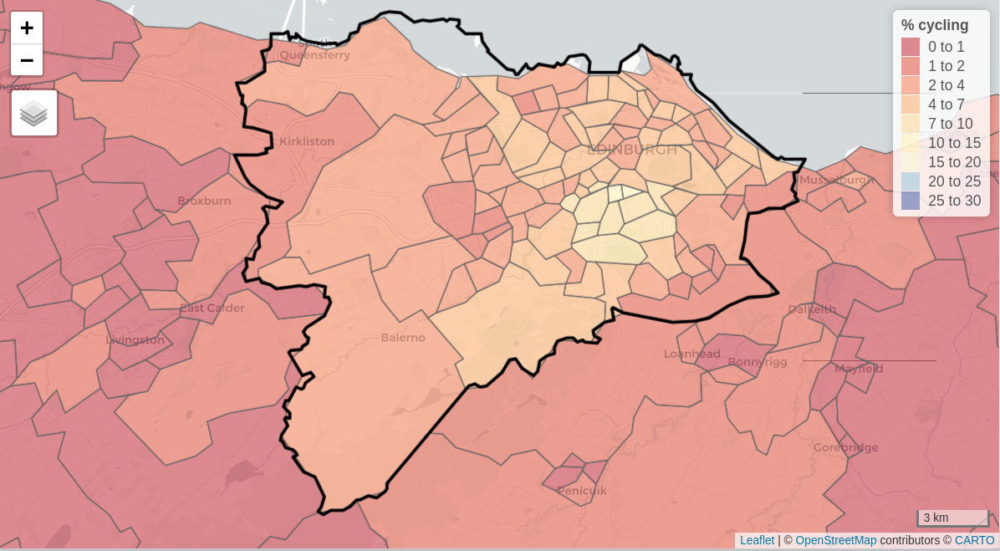

<!-- README.md is generated from README.Rmd. Please edit that file -->

```{r, include = FALSE}
knitr::opts_chunk$set(
  collapse = TRUE,
  comment = "#>",
  echo = FALSE,
  message = FALSE
)
library(sf)
library(tmap)
library(tidyverse)
```

```{r, eval=FALSE}
# Generate citations (requires Zotero)
library(rbbt)
# old way:
# bbt_write_bib(path = "references.bib", keys = bbt_detect_citations("README.Rmd"), overwrite = TRUE)
# new way:
bbt_update_bib("README.Rmd", "references.bib")
# trackdown::upload_file(file = "README.Rmd", path_output = "README.docx")
trackdown::update_file(file = "README.Rmd", path_output = "README.docx")
```


# Origin-destination Jittering: A computationally efficient method for generating realistic route networks from origin-destination data 

<!-- badges: start -->
[](https://github.com/Robinlovelace/odjitter/actions/workflows/render-rmarkdown.yaml)
<!-- badges: end -->

# Introduction

Origin-destination (OD) datasets are ubiquitous for representing travel behavior in transport planning and modelling.
Despite emerging large data sources, OD data continues to play an established --- if not central --- role in transport research in the 21^st^ century, with recent applications ranging from analysis of the evolution of urban activity and shared mobility services over time [e.g. @shi_exploring_2019; @li_effects_2019] to inference of congestion and mode split [@bachir_inferring_2019; @gao_method_2021]. 
Perhaps in part because they are so well established, there has been little research in recent years on new methods for processing OD datasets to add value and insight, notwithstanding notable exceptions for OD dataset validation [@alexander_validation_2015], aggregation [@he_simple_2018; @liu_snn_2021] and disaggregation [@katranji_mobility_2016].

An example of the utility of OD data, and the utility of open access (anonymised and aggregtated) OD data in particular, is Propensity to Cycle Tool (PCT), first launched nationally across England in 2017 [@lovelace_propensity_2017].
The PCT provides a strong and consistent evidence-base that local authorities across England and Wales are using to inform strategic Local Cycling and Walking Plans.
Based on OD data --- initially for commuting trips only but subsequently also based on travel to school data [@goodman_scenarios_2019] --- the tool visualises cycling potential at zone, desire line, route and route network levels.
The PCT makes open OD data 'come to life' by converting a 'haystack' of data into meaningful insights into currently cycling levels and future potential, highlighting the need to invest in cohesive networks of cycling interventions, as illustrated in Figure \@ref(fig:haystack).

```{r haystack, fig.cap="Illustration of how geographic visualisation and routing can add value to OD datasets and make them more policy relevant."}
# todo: update this
knitr::include_graphics("https://user-images.githubusercontent.com/1825120/142071229-81358e26-5e8d-437e-9ef8-91704a4e690f.png")
```


The PCT is available for use by local authorities, consultancies, cycling advocacy groups, academic researchers and members of the public.
Subsequent work building on the tool has been used to prioritise investment in active transport in the wake of the coronavirus pandemic [@lovelace_methods_2020].
Due to lack of comparable OD data and/or lack of funding, comparable tools have yet to be developed for other countries.
With the exception of regionally specific models using software such as sDNA [@cooper_using_2017] (the results of which are usually not in the public domain) and bespoke city-specific models [@larsen_build_2013; @zhang_prioritizing_2014], there are few large scale tools using OD data that are free for public use that we are aware of.

In this context, this paper outlines methods to add further value to OD data through processes of disaggregating OD data and 'jittering' to increase the density of route networks arising from the conversion of OD data into route network outputs of the kind illustrated in Figure \@ref(fig:haystack).

Before describing the methods, it is worth briefly defining OD data: datasets that consist of:

- **Origins**: information the departure for trips, typically a code that refers to a geographic zone or a coordinate representing an approximate point of departure
- **Destination**: information representing the destination of trips
- **Attributes**: typically the number of trips made between each 'OD pair', sometimes by mode and with additional attributes such as the Euclidean and route distance between the each OD pair

# Research question and hypothesis

The study area is the City of Edinburgh, a local authority with a population of just over half a million (524,930 as of [2019](https://www.nrscotland.gov.uk/files/statistics/council-area-data-sheets/city-of-edinburgh-council-profile.html)).
The population was 480,139 in the 2011 Census, 237,839 of whom were employed.
In the 2011 Census, 4.3% of residents of the area reported cycling to work, ranging from 1% in Intermediate Zone (IZ) Ferniehill, South Moredun and Craigour to 10% in the IZ Marchmont West.
There are 101 IZs (2001 definition) in the study region (see Figure \@ref(fig:izs)).


```{r read-region}
# lads_uk = ukboundaries::lad2018
# # names(lads_uk)
# lads_scotland = lads_uk %>% 
#   filter(str_detect(lau118cd, "S"))
# saveRDS(lads_scotland, "lads_scotland.Rds")
# library(dplyr)
# lads_scotland = readRDS("lads_scotland.Rds")
# piggyback::pb_upload("lads_scotland.Rds")

# edinburgh_region = lads_scotland %>%
#   dplyr::filter(lau118nm == "Edinburgh, City of")
# saveRDS(edinburgh_region, "edinburgh_region.Rds")
edinburgh_region = readRDS("edinburgh_region.Rds")
```

```{r izs, fig.cap="Overview of the study region with the percentage cycling to work in 2011 at the level of Intermediate Zones corresponding to fill colour.", out.width="90%"}

```

# Methods and data

<!-- The methods described in this paper were developed to support a project to support Edinburgh City Council with their strategic cycle network planning activity. -->
<!-- To understand the method and results it makes sense to start by introducing the case study area. -->
<!-- ## A synthetic example: synthetic zones -->
<!-- ## Real world example: Edinburgh -->

Beyond the zone data illustrated in Figure \@ref(fig:izs), the input dataset consisted of open access OD data from the 2011 census.
The OD data can be represented as both tabular and, when start and end points are assigned to centroids within each zone, as geographic entities, as illustrated in Figure \@ref(fig:od), which presents data at the zone and OD level for the top 3 OD pairs by number of interzonal travel between zones by all modes in Edinburgh in tabular and visual form.
The zone boundaries are based on open boundary data provided by data.gov.uk at the Middle Super Output Area (MSOA) level.

```{r}

```

```{r input-data}
u = "https://github.com/ITSLeeds/od/releases/download/0.2.1/od_iz_ed.Rds"
f = basename(u)
if(!file.exists(f)) download.file(u, f)
od = readRDS("od_iz_ed.Rds")
# head(od)

u = "https://github.com/ITSLeeds/od/releases/download/0.2.1/iz_zones11_ed.Rds"
f = basename(u)
if(!file.exists(f)) download.file(u, f)
zones = readRDS("iz_zones11_ed.Rds")
# head(zones)

u = "https://github.com/ITSLeeds/od/releases/download/0.2.1/iz_cents11_ed.Rds"
f = basename(u)
if(!file.exists(f)) download.file(u, f)
centroids = readRDS(f)
# head(centroids)

odsf = od::od_to_sf(od, centroids)
odsf_top3 = odsf %>%
  filter(geo_code1 != geo_code2) %>% 
  top_n(n = 3, wt = all) %>%
  select(geo_code1, geo_code2, all, foot, bicycle, bus, car_driver) %>% 
  arrange(desc(all))
centroids_top = centroids %>% 
  filter(InterZone %in% c(odsf_top3$geo_code1, odsf_top3$geo_code2))
# tmap_mode("view")

# k = odsf_top3 %>% 
#   sf::st_drop_geometry() %>% 
#   kableExtra::kable()
# k
m1 = tm_shape(odsf_top3) +
  tm_lines("foot", palette = "Set1", breaks = c(100, 200, 300, 400), lwd = 6) +
  tm_shape(zones) +
  tm_borders() +
  tm_shape(centroids_top) +
  tm_text("InterZone", size = 1.3) +
  tm_scale_bar()
# writeLines(k, "/tmp/kable.html")
# browseURL("/tmp/kable.html")
```


```{r od, fig.cap="Illustration of input data in tabular (above) and geographic form (below).", fig.show='hold', out.width="100%"}
knitr::include_graphics(c(
  "figures/od-top-3-table.png",
  "figures/od-top-3.png"
))
```


```{r desire}
# od_top_100 = od %>% 
#   top_n(n = 100, wt = all)
# desire_lines = od::od_to_sf(x = od_top_100, z = centroids)
# nrow(desire_lines)
# plot(desire_lines)
# subpoints = sf::st_sample(x = zones, size = 10000)
```

```{r jittered}
# desire_lines_jittered = od::od_jitter(od = desire_lines, z = zones)
# plot(desire_lines$geometry)
# plot(desire_lines_jittered$geometry)
```

## Jittering

## Disaggregation


```{r jitters, fig.cap="Illustration of jittering and disaggregation of OD data on small input dataset."}
set.seed(1)
od_top3_jittered = od::od_jitter(odsf_top3, z = zones)
od_top3_disaggregated = od::od_disaggregate(odsf_top3, z = zones, max_per_od = 100)
m2 = tm_shape(od_top3_jittered) +
  tm_lines("foot", palette = "Set1", breaks = c(100, 200, 300, 400), lwd = 6) +
  tm_shape(zones) +
  tm_borders() +
  tm_shape(centroids_top) +
  tm_text("InterZone", size = 1.3) +
  tm_scale_bar()
m3 = tm_shape(od_top3_disaggregated) +
  tm_lines("foot", palette = "Set1", lwd = 6) +
  tm_shape(zones) +
  tm_borders() +
  tm_shape(centroids_top) +
  tm_text("InterZone", size = 1.3) +
  tm_scale_bar()
# m3
tmap_arrange(m1, m2, m3, nrow = 1)
```


# Findings

We found that re-sampling origin and start points during the conversion of tabular OD datasets to their representation as geographic 'desire lines' can be undertaken in a variety of ways, including simple random sampling, sampling nodes on transport networks and simulating origin and destination points in polygons representing building.
Building on the established practice of jittering in data visualisation [ref], we label this group of techniques 'origin-destination jittering'.

We found that OD jittering led to substantially more dense and realistic route networks.


# References

