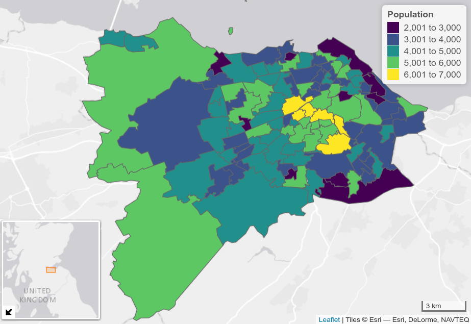

Jittering: A computationally efficient method for generating realistic
route networks from origin-destination data
================

<!-- README.md is generated from README.Rmd. Please edit that file -->
<!-- badges: start -->

<!-- badges: end -->

# 1 Questions

Origin-destination (OD) datasets are ubiquitous, used by statistical and
transport planning organisations to efficiently represent aggregate
travel behavior worldwide. Despite emerging ‘big data’ sources such as
massive GPS datasets, OD data continues to play an established — if not
central — role in transport research in the 21st century.
Recent applications range from analysis of the evolution of urban
activity and shared mobility services over time (e.g. Shi et al. 2019;
Li et al. 2019) to inference of congestion and mode split (Bachir et al.
2019; Gao et al. 2021).

<!-- Perhaps in part because they are so well established, comparatively few recent research papers have explored new methods for processing OD datasets. -->

Recent papers have presented new methods for OD dataset validation
(Alexander et al. 2015), aggregation (He et al. 2018; Liu et al. 2021)
and disaggregation (Katranji et al. 2016). To the best of our knowledge,
this is the first paper to describe and test methods for randomising
origin and destination points and disaggregation on a real world example
using reproducible analysis and open access data, a process we refer to
as ‘jittering’.

<!-- In this paper we outline such methods and their uses, demonstrating how jittering can be used to create more diffuse and accurate estimates of movement at the level of segments ('flows') on transport network, with minimal computational overheads compared with the computationally intensive process of route calculation ('routing') or processing large GPS datasets. -->
<!-- Long version of paper: -->
<!-- We do this by defining OD datasets, their uses, and other terms in relation to jittering, in Section <a href="#od"><strong>??</strong></a>; describing a real world case study, input datasets, and methods, in Section <a href="#methods">2</a>; presenting the results of different jittering techniques in Section <a href="#findings">3</a>; and discussing the potential uses of and next steps for the development of methods to add value to OD datasets for sustainable transport planning in section <a href="#discussion"><strong>??</strong></a>. -->
<!-- Short version of paper: -->
<!-- We do this by defining OD datasets, their uses, and other terms in relation to jittering, in this introduction; outlining the research question with reference to a real world case study of modelling cycling networks in Edinburgh, in Section <a href="#q"><strong>??</strong></a>; describing the results in Section <a href="#methods">2</a>; and presenting the results of different jittering techniques in Section <a href="#findings">3</a>. -->
<!-- # Origin-destination data {#od} -->
<!-- First, a description of the utility of OD data in contemporary policy contexts, and definitions, are in order. -->
<!-- An example of the utility of OD data, and the utility of open access (anonymised and aggregtated) OD data in particular, is Propensity to Cycle Tool (PCT), first launched nationally across England in 2017 [@lovelace_propensity_2017]. -->
<!-- The PCT provides a strong and consistent evidence-base that local authorities across England and Wales are using to inform strategic Local Cycling and Walking Plans. -->
<!-- Based on OD data --- initially for commuting trips only but subsequently also based on travel to school data [@goodman_scenarios_2019] --- the tool visualises cycling potential at zone, desire line, route and route network levels, and is being used by government, consultancy and public/advocacy stakeholders nationwide [@lovelace_open_2020]. -->
<!-- The PCT makes open OD data 'come to life' by converting a 'haystack' of data into meaningful insights into currently cycling levels and future potential, highlighting the need to invest in cohesive networks of cycling interventions, as illustrated in Figure <a href="#fig:haystack"><strong>??</strong></a>. -->
<!-- The PCT is available for use by local authorities, consultancies, cycling advocacy groups, academic researchers and members of the public. -->
<!-- Subsequent work building on the tool has been used to prioritise investment in active transport in the wake of the coronavirus pandemic [@lovelace_methods_2020]. -->
<!-- Comparable tools have yet to be developed and deployed publicly in most other countries. -->
<!-- With the exception of regionally specific models using software such as sDNA [@cooper_using_2017] (the results of which are usually not in the public domain) and bespoke city-specific models [@larsen_build_2013; @zhang_prioritizing_2014], there are few large scale tools using OD data that are free for public use that we are aware of. -->
<!-- In this context, this paper outlines methods to add further value to OD data through processes of disaggregating OD data and 'jittering' to increase the density of route networks arising from the conversion of OD data into route network outputs of the kind illustrated in Figure <a href="#fig:haystack"><strong>??</strong></a>. -->

The following question motivated the development of the jittering
approach presented in this paper:

> How can OD data representing trips between large geographic zones be
> used more effectively, to generate results at the level of segments
> representing route networks of current or potential flow to inform
> local interventions?

Our hypothesis was that pre-processing OD data using methods described
in this paper would lead to more effective use of OD data in transport
planning. Before describing the approach to answer this question, some
definitions are in order:

<!-- , it is worth briefly defining OD data: datasets that consist of: -->

-   **Origins**: information the departure for trips, in this context
    IDs associated with zones of departure
-   **Destinations**: IDs representing the destination of trips
-   **Attributes**: typically the number of trips made between each ‘OD
    pair’, sometimes by mode and with additional attributes such as the
    Euclidean and route distance between the each OD pair
-   **Jittering**: The combined process of ‘splitting’ OD pairs
    representing many trips into multiple ‘sub OD’ pairs
    (disaggregation) and assigning origins and destinations to multiple
    unique points within each zone

# 2 Methods

<!-- The methods described in this paper were developed to support a project to support Edinburgh City Council with their strategic cycle network planning activity. -->
<!-- To understand the method and results it makes sense to start by introducing the case study area. -->
<!-- ## A synthetic example: synthetic zones -->
<!-- ## Real world example: Edinburgh -->

The study area is the City of Edinburgh, a local authority with a
population of just over half a million
[people](https://www.nrscotland.gov.uk/files/statistics/council-area-data-sheets/city-of-edinburgh-council-profile.html)
(see Figure <a href="#fig:izs"><strong>??</strong></a>).

Beyond the zone data illustrated in Figure
<a href="#fig:izs"><strong>??</strong></a>, the input dataset consisted
of open access OD data from the 2011 census. The OD data can be
represented as both tabular and, when start and end points are assigned
to centroids within each zone, as geographic entities, as illustrated in
a sample of three OD pairs presented in Figure
<a href="#fig:od"><strong>??</strong></a>.
<!-- , which presents data at the zone and OD level for the top 3 OD pairs by number of interzonal travel between zones by all modes in Edinburgh in tabular and visual form. -->
<!-- The zone boundaries are based on open boundary data provided by data.gov.uk at the Middle Super Output Area (MSOA) level. -->
<!-- The population was 480,139 in the 2011 Census, 237,839 of whom were employed. -->
<!-- In the 2011 Census, 4.3% of residents of the area reported cycling to work, ranging from 1% in Intermediate Zone (IZ) Ferniehill, South Moredun and Craigour to 10% in the IZ Marchmont West. -->
<!-- There are 101 IZs (2001 definition) in the study region. -->

The techniques outlined in the following sub-sections are perhaps best
understood visually, as illustrated in Figure
<a href="#fig:jitters">2.1</a>. The remainder of this section describes
the methods illustrated in each of the facetted maps in Figure
<a href="#fig:jitters">2.1</a>.

## 2.1 Random sampling of origin and destination points

The simplest approach to jittering is simple random spatial sampling, as
illustrated in Figure <a href="#fig:jitters">2.1</a> (B). This involves
generating random coordinate pairs using a random number generator,
testing to check if the point is contained withing the boundary of each
zone from which points are required, and repeating the process until
enough randomly located points have been created. This approach has the
advantages of simplicity, requiring no additional datasets. A
disadvantage of simple random sampling in areas where trip origins and
trip attractors are concentrated within certain parts of geographic
zones, such as in rural areas, is that it may lead to unrealistic
results, e.g. with trips being simulated to start in rivers and in
uninhabited wilderness areas.

## 2.2 Sampling origin and destination points from the transport network

To overcome the limitations of the simple random sampling approach, the
universe of possible coordinates from which trips can originate and end
can be reduced by providing another geographic input dataset. This
dataset could contain known trip attractors such as city centres and
work places, as well as tightly defined residential ‘subzones’. For
highly disaggregated flows in cases where accurate building datasets are
available, building footprints could also be used.

Perhaps the most useful type of subsampling, however, is on the road
network, as illustrated in Figure <a href="#fig:jitters">2.1</a> (C):
transport network datasets are readily available in most places and
ensure that all trips happen on the network, an advantage when using
some routing services.

## 2.3 Disaggregation

Both of the jittering techniques outlined above generate more diffuse
route networks. However, a problem with OD datasets is that they are
often highly variable: one OD pair could represent 1 trip, while another
could represent 1000 trips. To overcome this problem a process of
disaggregation can be used, resulting in additional OD pairs within each
pair of zones. This process is illustrated in Figure
<a href="#fig:jitters">2.1</a> (D).

## 2.4 Jittering

We refer to the combined process of sampling origin and destination
points — either using simple random geographic sampling, sampling from
the transport network, or other sampling technique — and disagreggation
as jittering.

# 3 Findings

We found that re-sampling origin and start points during the conversion
of tabular OD datasets to their representation as geographic ‘desire
lines’ can be undertaken in a variety of ways, including simple random
sampling, sampling nodes on transport networks and simulating origin and
destination points in polygons representing building. Building on the
established practice of jittering in data visualisation \[ref\], we
label this group of techniques ‘origin-destination jittering’, which
includes the vital ‘disaggregation’ step to ensure a diffuse network.

The results of applying each of these jittering techniques to an OD
dataset representing travel to work in Edinburgh are illustrated in
Figure <a href="#fig:rneted">3.1</a>. The results demonstrate that OD
jittering led to substantially more dense and presumably more realistic
route networks. In future work we aim to evaluate the extent to which
route networks that are derived from jittered datasets are better, with
reference to comparisons between observed travel behavior on transport
networks including from manual and automatic counters at point locations
and other sources of data.

<!-- # Discussion -->

# 4 References

Alexander, Lauren, Shan Jiang, Mikel Murga, and Marta C Gonz. 2015.
“Validation of Origin-Destination Trips by Purpose and Time of Day
Inferred from Mobile Phone Data.” *Transportation Research Part B:
Methodological*, 1–20. <https://doi.org/10.1016/j.trc.2015.02.018>.

Bachir, Danya, Ghazaleh Khodabandelou, Vincent Gauthier, Mounim El
Yacoubi, and Jakob Puchinger. 2019. “Inferring Dynamic
Origin-Destination Flows by Transport Mode Using Mobile Phone Data.”
*Transportation Research Part C: Emerging Technologies* 101: 254–75.

Gao, Hong, Zhenjun Yan, Xu Hu, Zhaoyuan Yu, Wen Luo, Linwang Yuan, and
Jiyi Zhang. 2021. “A Method for Exploring and Analyzing Spatiotemporal
Patterns of Traffic Congestion in Expressway Networks Based on
Origin–Destination Data.” *ISPRS International Journal of
Geo-Information* 10 (5): 288.

He, Biao, Yan Zhang, Yu Chen, and Zhihui Gu. 2018. “A Simple Line
Clustering Method for Spatial Analysis with Origin-Destination Data and
Its Application to Bike-Sharing Movement Data.” *ISPRS International
Journal of Geo-Information* 7 (6): 203.
<https://doi.org/10.3390/ijgi7060203>.

Katranji, Mehdi, Etienne Thuillier, Sami Kraiem, Laurent Moalic, and
Fouad Hadj Selem. 2016. “Mobility Data Disaggregation: A Transfer
Learning Approach.” In *2016 IEEE 19th International Conference on
Intelligent Transportation Systems (ITSC)*, 1672–77.
<https://doi.org/10.1109/ITSC.2016.7795783>.

Li, Haojie, Yingheng Zhang, Hongliang Ding, and Gang Ren. 2019. “Effects
of Dockless Bike-Sharing Systems on the Usage of the London Cycle Hire.”
*Transportation Research Part A: Policy and Practice* 130 (December):
398–411. <https://doi.org/10.1016/j.tra.2019.09.050>.

Liu, Qiliang, Jie Yang, Min Deng, Ci Song, and Wenkai Liu. 2021.
“SNN\_flow: A Shared Nearest-Neighbor-Based Clustering Method for
Inhomogeneous Origin-Destination Flows.” *International Journal of
Geographical Information Science*, 1–27.

Shi, Xiaoying, Fanshun Lv, Dewen Seng, Baixi Xing, and Jing Chen. 2019.
“Exploring the Evolutionary Patterns of Urban Activity Areas Based on
Origin-Destination Data.” *IEEE Access* 7: 20416–31.

