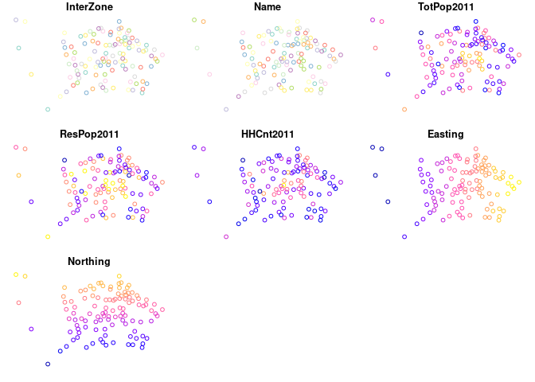
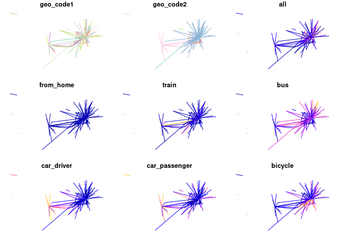
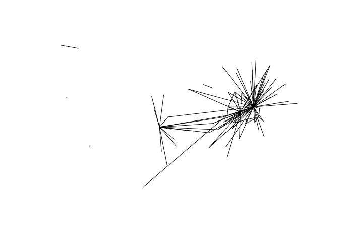
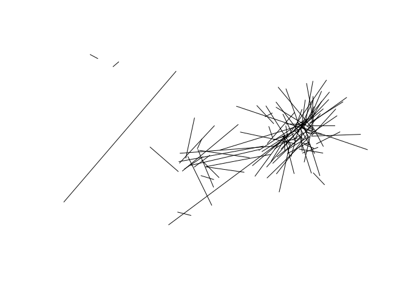

<!-- README.md is generated from README.Rmd. Please edit that file -->

# 1 Origin-destination Jittering: A computationally efficient method for generating realistic route networks from origin-destination data

<!-- badges: start -->

<!-- badges: end -->

# 2 Introduction

Origin-destination (OD) datasets are ubiquitous for representing travel
behavior in transport planning and modelling. Despite emerging large
data sources, OD data continues to play an established — if not central
— role in transport research in the 21st century, with recent
applications ranging from analysis of the evolution of urban activity
and shared mobility services over time (e.g. Shi et al. 2019; Li et al.
2019) to inference of congestion and mode split (Bachir et al. 2019; Gao
et al. 2021). Perhaps in part because they are so well established,
there has been little research in recent years on new methods for
processing OD datasets to add value and insight, notwithstanding notable
exceptions for OD dataset validation (Alexander et al. 2015),
aggregation (He et al. 2018; Liu et al. 2021) and disaggregation
(Katranji et al. 2016).

An example of the utility of OD data, and the utility of open access
(anonymised and aggregtated) OD data in particular, is Propensity to
Cycle Tool (PCT), first launched nationally across England in 2017
(Lovelace et al. 2017). The PCT provides a strong and consistent
evidence-base that local authorities across England and Wales are using
to inform strategic Local Cycling and Walking Plans. Based on OD data —
initially for commuting trips only but subsequently also based on travel
to school data (Goodman et al. 2019) — the tool visualises cycling
potential at zone, desire line, route and route network levels. The PCT
makes open OD data ‘come to life’ by converting a ‘haystack’ of data
into meaningful insights into currently cycling levels and future
potential, highlighting the need to invest in cohesive networks of
cycling interventions, as illustrated in Figure
<a href="#fig:haystack">2.1</a>.

The PCT is available for use by local authorities, consultancies,
cycling advocacy groups, academic researchers and members of the public.
Subsequent work building on the tool has been used to prioritise
investment in active transport in the wake of the coronavirus pandemic
(Lovelace et al. 2020). Due to lack of comparable OD data and/or lack of
funding, comparable tools have yet to be developed for other countries.
With the exception of regionally specific models using software such as
sDNA (Cooper 2017) (the results of which are usually not in the public
domain) and bespoke city-specific models (**larsen_build_2013?**;
**zhang_prioritizing_2014?**), there are few large scale tools using OD
data that are free for public use that we are aware of.

In this context, this paper outlines methods to add further value to OD
data through processes of disaggregating OD data and ‘jittering’ to
increase the density of route networks arising from the conversion of OD
data into route network outputs of the kind illustrated in Figure
<a href="#fig:haystack">2.1</a>.

Before describing the methods, it is worth briefly defining OD data:
datasets that consist of:

-   **Origins**: information the departure for trips, typically a code
    that refers to a geographic zone or a coordinate representing an
    approximate point of departure
-   **Destination**: information representing the destination of trips
-   **Attributes**: typically the number of trips made between each ‘OD
    pair’, sometimes by mode and with additional attributes such as the
    Euclidean and route distance between the each OD pair

# 3 Research question and hypothesis

The study area is the City of Edinburgh, a local authority with a
population of just over half a million (524,930 as of
[2019](https://www.nrscotland.gov.uk/files/statistics/council-area-data-sheets/city-of-edinburgh-council-profile.html)).
The population was 480,139 in the 2011 Census, 237,839 of whom were
employed. In the 2011 Census, 4.3% of residents of the area reported
cycling to work, ranging from 1% in Intermediate Zone (IZ) Ferniehill,
South Moredun and Craigour to 10% in the IZ Marchmont West. There are
101 IZs (2001 definition) in the study region (see Figure
<a href="#fig:izs"><strong>??</strong></a>).

# 4 Methods and data

The methods described in this paper were developed to support a project
to support Edinburgh City Council with their strategic cycle network
planning activity. To understand the method and results it makes sense
to start by introducing the case study area.

<!-- ## A synthetic example: synthetic zones -->

## 4.1 Real world example: Edinburgh

    #> # A tibble: 6 × 11
    #>   geo_code1 geo_code2   all from_home train   bus car_driver car_passenger
    #>   <chr>     <chr>     <dbl>     <dbl> <dbl> <dbl>      <dbl>         <dbl>
    #> 1 S02001576 S02001576   151         0     0     6         61             7
    #> 2 S02001576 S02001577   132         0     0    11         84            10
    #> 3 S02001576 S02001578    40         0     0     5         32             2
    #> 4 S02001576 S02001579    17         0     0     4         13             0
    #> 5 S02001576 S02001580     2         0     0     0          2             0
    #> 6 S02001576 S02001581    11         0     1     2          8             0
    #> # … with 3 more variables: bicycle <dbl>, foot <dbl>, other <dbl>
    #> Simple feature collection with 6 features and 9 fields
    #> Geometry type: MULTIPOLYGON
    #> Dimension:     XY
    #> Bounding box:  xmin: -3.434535 ymin: 55.81879 xmax: -3.205699 ymax: 55.92223
    #> Geodetic CRS:  WGS 84
    #> # A tibble: 6 × 10
    #>   InterZone Name            TotPop2011 ResPop2011 HHCnt2011 StdAreaHa StdAreaKm2
    #>   <chr>     <chr>                <int>      <int>     <int>     <dbl>      <dbl>
    #> 1 S02001576 Balerno and Bo…       5796       5771      2365     4805.      48.0 
    #> 2 S02001577 Currie West           4782       3272      1386      810.       8.10
    #> 3 S02001578 Currie East           3050       3050      1273      216.       2.16
    #> 4 S02001579 Baberton and J…       3954       3918      1694      117.       1.17
    #> 5 S02001580 Bonaly and The…       4295       4273      1767     1973.      19.7 
    #> 6 S02001581 Colinton and K…       4112       3743      1587      302.       3.02
    #> # … with 3 more variables: Shape_Leng <dbl>, Shape_Area <dbl>,
    #> #   geometry <MULTIPOLYGON [°]>
    #> Simple feature collection with 6 features and 7 fields
    #> Geometry type: POINT
    #> Dimension:     XY
    #> Bounding box:  xmin: -3.342444 ymin: 55.88086 xmax: -3.246474 ymax: 55.90971
    #> Geodetic CRS:  WGS 84
    #> # A tibble: 6 × 8
    #>   InterZone Name                TotPop2011 ResPop2011 HHCnt2011 Easting Northing
    #>   <chr>     <chr>                    <int>      <int>     <int>   <dbl>    <dbl>
    #> 1 S02001576 Balerno and Bonnin…       5796       5771      2365  316116   666116
    #> 2 S02001577 Currie West               4782       3272      1386  317812   667813
    #> 3 S02001578 Currie East               3050       3050      1273  318655   668420
    #> 4 S02001579 Baberton and Junip…       3954       3918      1694  319584   669262
    #> 5 S02001580 Bonaly and The Pen…       4295       4273      1767  321320   668240
    #> 6 S02001581 Colinton and Kings…       4112       3743      1587  322169   668751
    #> # … with 1 more variable: geometry <POINT [°]>

<!-- -->

    #> 0 origins with no match in zone ids
    #> 0 destinations with no match in zone ids
    #>  points not in od data removed.
    #> [1] 101
    #> Warning: plotting the first 9 out of 11 attributes; use max.plot = 11 to plot
    #> all

<!-- -->

<!-- --><!-- -->

# 5 Findings

We found that re-sampling origin and start points during the conversion
of tabular OD datasets to their representation as geographic ‘desire
lines’ can be undertaken in a variety of ways, including simple random
sampling, sampling nodes on transport networks and simulating origin and
destination points in polygons representing building. Building on the
established practice of jittering in data visualisation \[ref\], we
label this group of techniques ‘origin-destination jittering’.

We found that OD jittering led to substantially more dense and realistic
route networks.

# 6 References

Alexander, Lauren, Shan Jiang, Mikel Murga, and Marta C Gonz. 2015.
“Validation of Origin-Destination Trips by Purpose and Time of Day
Inferred from Mobile Phone Data.” *Transportation Research Part B:
Methodological*, 1–20. <https://doi.org/10.1016/j.trc.2015.02.018>.

Bachir, Danya, Ghazaleh Khodabandelou, Vincent Gauthier, Mounim El
Yacoubi, and Jakob Puchinger. 2019. “Inferring Dynamic
Origin-Destination Flows by Transport Mode Using Mobile Phone Data.”
*Transportation Research Part C: Emerging Technologies* 101: 254–75.

Cooper, Crispin H. V. 2017. “Using Spatial Network Analysis to Model
Pedal Cycle Flows, Risk and Mode Choice.” *Journal of Transport
Geography* 58 (January): 157–65.
<https://doi.org/10.1016/j.jtrangeo.2016.12.003>.

Gao, Hong, Zhenjun Yan, Xu Hu, Zhaoyuan Yu, Wen Luo, Linwang Yuan, and
Jiyi Zhang. 2021. “A Method for Exploring and Analyzing Spatiotemporal
Patterns of Traffic Congestion in Expressway Networks Based on
Origin–Destination Data.” *ISPRS International Journal of
Geo-Information* 10 (5): 288.

Goodman, Anna, Ilan Fridman Rojas, James Woodcock, Rachel Aldred,
Nikolai Berkoff, Malcolm Morgan, Ali Abbas, and Robin Lovelace. 2019.
“Scenarios of Cycling to School in England, and Associated Health and
Carbon Impacts: Application of the ‘Propensity to Cycle Tool’.” *Journal
of Transport & Health* 12 (March): 263–78.
<https://doi.org/10.1016/j.jth.2019.01.008>.

He, Biao, Yan Zhang, Yu Chen, and Zhihui Gu. 2018. “A Simple Line
Clustering Method for Spatial Analysis with Origin-Destination Data and
Its Application to Bike-Sharing Movement Data.” *ISPRS International
Journal of Geo-Information* 7 (6): 203.
<https://doi.org/10.3390/ijgi7060203>.

Katranji, Mehdi, Etienne Thuillier, Sami Kraiem, Laurent Moalic, and
Fouad Hadj Selem. 2016. “Mobility Data Disaggregation: A Transfer
Learning Approach.” In *2016 IEEE 19th International Conference on
Intelligent Transportation Systems (ITSC)*, 1672–77.
<https://doi.org/10.1109/ITSC.2016.7795783>.

Li, Haojie, Yingheng Zhang, Hongliang Ding, and Gang Ren. 2019. “Effects
of Dockless Bike-Sharing Systems on the Usage of the London Cycle Hire.”
*Transportation Research Part A: Policy and Practice* 130 (December):
398–411. <https://doi.org/10.1016/j.tra.2019.09.050>.

Liu, Qiliang, Jie Yang, Min Deng, Ci Song, and Wenkai Liu. 2021.
“SNN\_flow: A Shared Nearest-Neighbor-Based Clustering Method for
Inhomogeneous Origin-Destination Flows.” *International Journal of
Geographical Information Science*, 1–27.

Lovelace, Robin, Anna Goodman, Rachel Aldred, Nikolai Berkoff, Ali
Abbas, and James Woodcock. 2017. “The Propensity to Cycle Tool: An Open
Source Online System for Sustainable Transport Planning.” *Journal of
Transport and Land Use* 10 (1). <https://doi.org/10.5198/jtlu.2016.862>.

Lovelace, Robin, Joseph Talbot, Malcolm Morgan, and Martin Lucas-Smith.
2020. “Methods to Prioritise Pop-up Active Transport Infrastructure.”
*Transport Findings*, July, 13421.
<https://doi.org/10.32866/001c.13421>.

Shi, Xiaoying, Fanshun Lv, Dewen Seng, Baixi Xing, and Jing Chen. 2019.
“Exploring the Evolutionary Patterns of Urban Activity Areas Based on
Origin-Destination Data.” *IEEE Access* 7: 20416–31.

