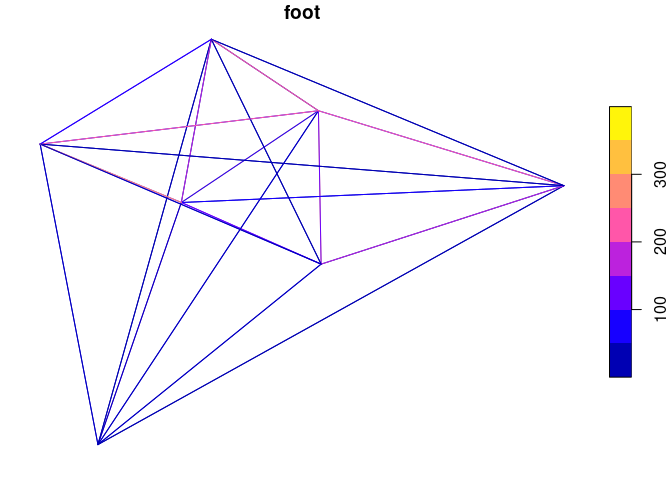
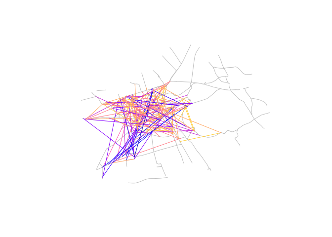

This document provides details on the implementation of methods for
jittering OD data, as set out in the paper “Jittering: A computationally
efficient method for generating realistic route networks from
origin-destination data”.

# Setup

To reproduce the code in this document you need R and Rust installed.
You need to have installed and loaded the following packages:

``` r
library(od)
library(dplyr)
```

# Input data

The input files consist of a .csv file representing travel between zones
and .geojson files representing zones and the transport network.

The .csv file can be read-in and printed as follows

``` r
od = readr::read_csv("https://github.com/ITSLeeds/od/releases/download/v0.3.1/od_min.csv")
```

    ## Rows: 49 Columns: 11

    ## ── Column specification ────────────────────────────────────────────────────────
    ## Delimiter: ","
    ## chr (2): geo_code1, geo_code2
    ## dbl (9): all, from_home, train, bus, car_driver, car_passenger, bicycle, foo...

    ## 
    ## ℹ Use `spec()` to retrieve the full column specification for this data.
    ## ℹ Specify the column types or set `show_col_types = FALSE` to quiet this message.

``` r
head(od)
```

    ## # A tibble: 6 × 11
    ##   geo_code1 geo_code2   all from_home train   bus car_driver car_passenger
    ##   <chr>     <chr>     <dbl>     <dbl> <dbl> <dbl>      <dbl>         <dbl>
    ## 1 S02001616 S02001616    82         0     0     3          6             0
    ## 2 S02001616 S02001620   188         0     0    42         26             3
    ## 3 S02001616 S02001621    99         0     0    13          7             3
    ## 4 S02001616 S02001622   228         0     1    92         23             2
    ## 5 S02001616 S02001623    31         0     0     8          0             0
    ## 6 S02001616 S02001656    56         0     0    23          5             1
    ## # … with 3 more variables: bicycle <dbl>, foot <dbl>, other <dbl>

The GeoJSON files can be read-in and plotted in R as follows:

``` r
zones = sf::read_sf("https://github.com/ITSLeeds/od/releases/download/v0.3.1/zones_min.geojson")
road_net = sf::read_sf("https://github.com/ITSLeeds/od/releases/download/v0.3.1/road_network_min.geojson")
plot(zones$geometry)
plot(road_net, col = "red", add = TRUE)
```

    ## Warning in plot.sf(road_net, col = "red", add = TRUE): ignoring all but the
    ## first attribute

<!-- -->

The OD dataset can be converted to geographic desire lines as follows:

``` r
desire_lines = od::od_to_sf(od, zones)
```

    ## 0 origins with no match in zone ids

    ## 0 destinations with no match in zone ids

    ##  points not in od data removed.

``` r
plot(desire_lines %>% select(foot))
```

<!-- -->

# Jittering in R

The R implementation of jittering works as follows, with the unjittered
representation of the data on the left and jittered representation of
the data on the right:

``` r
j1 = od::od_jitter(od = od, z = zones, subpoints = road_net, max_per_od = 50)
```

    ## 0 origins with no match in zone ids

    ## 0 destinations with no match in zone ids

    ##  points not in od data removed.

    ## Using od_disaggregate

    ## Input object is sf, attempting to convert to a data frame

    ## Converting lines on network to points

``` r
plot(road_net$geometry, col = "grey")
plot(j1 %>% select(foot), add = TRUE)
```

<!-- -->

What happened? The input dataset consisting of 49 was disaggregated into
an equivalent dataset with 155 rows. Start and end points were sampled
on the road network. However, the total amount of flow remained
unchanged, as can be seen by looking at equivalent data for the first
row in the `od` and `j1` datasets:

``` r
od %>%
  slice(1) %>% 
  knitr::kable()
```

| geo_code1 | geo_code2 | all | from_home | train | bus | car_driver | car_passenger | bicycle | foot | other |
|:----------|:----------|----:|----------:|------:|----:|-----------:|--------------:|--------:|-----:|------:|
| S02001616 | S02001616 |  82 |         0 |     0 |   3 |          6 |             0 |       2 |   71 |     0 |

``` r
j1 %>% 
  filter(paste0(o_agg, d_agg) == paste0(od$geo_code1[1], od$geo_code2[1])) %>% 
  knitr::kable()
```

| o   | d   | all | from_home | train | bus | car_driver | car_passenger | bicycle | foot | other | o_agg     | d_agg     | geometry                     |
|:----|:----|----:|----------:|------:|----:|-----------:|--------------:|--------:|-----:|------:|:----------|:----------|:-----------------------------|
| 19  | 4   |  41 |         0 |     0 | 1.5 |          3 |             0 |       1 | 35.5 |     0 | S02001616 | S02001616 | LINESTRING (-3.205859 55.93… |
| 28  | 23  |  41 |         0 |     0 | 1.5 |          3 |             0 |       1 | 35.5 |     0 | S02001616 | S02001616 | LINESTRING (-3.205589 55.93… |

The column totals add up so both representations contain the same travel
data, just more geographically distributed. You can increase the amount
of geographic distribution but decreasing values passed to the
`max_per_od` argument in the `od_jitter()` function.

An issue with the function is that it is slow.

``` r
bench::mark(
  R = od::od_jitter(od = od, z = zones, subpoints = road_net, max_per_od = 50)
)
```

    ## Warning: Some expressions had a GC in every iteration; so filtering is disabled.

    ## # A tibble: 1 × 6
    ##   expression      min   median `itr/sec` mem_alloc `gc/sec`
    ##   <bch:expr> <bch:tm> <bch:tm>     <dbl> <bch:byt>    <dbl>
    ## 1 R             575ms    575ms      1.74    23.2MB     22.6

The output above shows it took almost a second to jitter the 49 lines in
the input dataset, and tests suggest that the function slows down
substantially as the size of the input datasets increases.

So maybe it’s worth implementing a solution in another lanugage such as
Rust.

# Jittering in Rust

``` r
library(rextendr)
```

``` rust
rprintln!("Hello from Rust!");

let x = 5;
let y = 7;
let z = x*y;

z
```

    ## Hello from Rust!
    ## [1] 35
